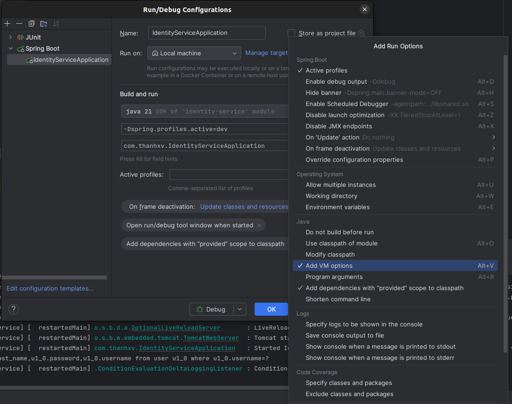
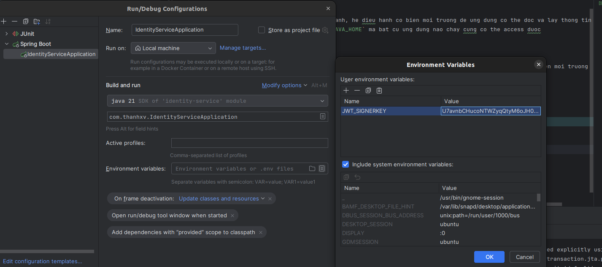

# Profiles
## Su dung file `application-*.properties`
- Su dung file `application-*.properties` cho environment tuong ung



## Bien moi truong 
### Problem
- Khi su dung file `.properties` cac thong tin nhay cam van dc luu trong source code
- Su dung bien moi truong de xu ly

### Offical docs
- https://docs.spring.io/spring-boot/reference/features/external-config.html

### Summary
- Cac ung dung duoc deploy tren 1 he dieu hanh, he dieu hanh co bien moi truong de ung dung co the doc va lay thong tin ra
- VD trong window co the bien moi truong `JAVA_HOME` ma bat cu ung dung nao chay cung co the access duoc
  - ```shell
    echo $Env:JAVA_HOME
    ```
- Thi co the config cac thong tin nhay cam o day thay vi doc thong tin tu file `.properties` se doc tu bien moi truong

### Implement
- Convention de Binding bien moi truong vao ung dung doc duoc. **Binding From Environment Variables**
- Ex:
  - ```yaml
    jwt:
      signerKey: "8sEj9ggy4UGKnWVVMEYgz0Uk89+vJPsaD2WPO2EOrKZ0nlvmSB1KfyyAHjHyH7v1"
    ```
  - 
- Tuy nhien co 1 van de co the xay ra do la 1 so bien can override 1 so bien co the khong can
  - Cac bien can override value se nam o khap noi trong file .properties
  - Do do thay vi dung key truc tiep thi se dung cac key da duoc dinh truoc
    ```yaml
      spring:
        datasource:
          url: ${DBMS_CONNECTION:jdbc:mysql://localhost:3306/identity_service}