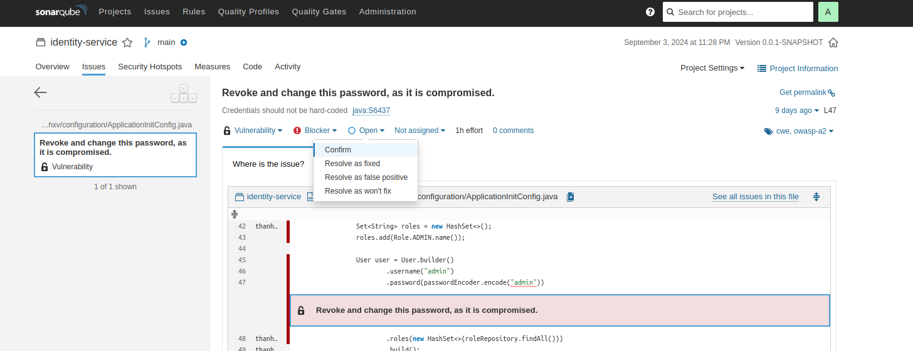

# Sonarqube
# Depend on Jacoco to report unit test

---
# Install sonarqube on local

## Docker 
- Search `sonarqube` on Docker hub then pull on local
```shell
docker pull sonarqube:lts-community
```

```shell
docker run --name sonar-qube -p 9000:9000 -d sonarqube:lts-community
```

## Access on browser
```shell
localhost:9000
```
- user/password : admin/admin
- then require change => admin/admin123

---
# How to scan
- Choose `Manual` from home page
- Input Project/Main branch => click `Set Up`
- Choose `Locally` vi dang scan tren local
- 1. Provide a token => vi local nen de `Expires` la `No Expiry` => `Generate`
- 2. Choose `Maven` vi project la maven => **SE NHAN DUOC 1 SCRIPT** => chay script do trong terminal cua project
  ```shell
    mvn clean verify sonar:sonar \
    -Dsonar.projectKey=thanhxv.identity \
    -Dsonar.host.url=http://localhost:9000 \
    -Dsonar.login=sqp_11f960b5c08a4b33248be06ecb37924a02d2dba7

> Voi Win thi phai chay bang Command Prompt moi dc

## Khi can reanalyze thi chay command 
```shell
  mvn clean verify sonar:sonar \
  -Dsonar.projectKey=thanhxv.identity \
  -Dsonar.host.url=http://localhost:9000 \
  -Dsonar.login=sqp_11f960b5c08a4b33248be06ecb37924a02d2dba7
```

---
# How to use ?
## Mark Resolve as won't fix
- Neu co bug trong du tinh va chon `Resolve as won't fix` de lan sau scan khong detect loi do nua


---
# WHY not have define plugin `sonar-maven-plugin` on `pom.xml` 
## Jacoco need define 
## **Gia thich 1**
Khi bạn làm việc với các plugin Maven như Jacoco và SonarQube, có sự khác biệt về cách các plugin này được quản lý và sử dụng trong dự án Maven.

### 1\. **Jacoco Plugin**

Jacoco là một công cụ phân tích mã nguồn để kiểm tra độ phủ mã (code coverage). Để sử dụng Jacoco trong dự án Maven của bạn, bạn cần khai báo plugin trong pom.xml của dự án. Điều này là cần thiết vì Jacoco không được tích hợp sẵn trong Maven và cần phải được cấu hình cụ thể để chạy các kiểm tra và tạo báo cáo.

### 2\. **SonarQube Plugin**

SonarQube là một công cụ phân tích mã nguồn để tìm lỗi, lỗ hổng bảo mật, và vấn đề về chất lượng mã. Plugin SonarQube cho Maven (sonar-maven-plugin) thường không cần phải được khai báo cụ thể trong pom.xml của dự án. Điều này là bởi vì:

*   **Chạy từ Command Line:** Bạn có thể chạy lệnh mvn sonar:sonar mà không cần cấu hình plugin trong pom.xml. Maven sẽ tự động tải plugin từ Maven Central Repository nếu cần thiết.

*   **Tích Hợp:** SonarQube thường được cấu hình và sử dụng qua command line và các tham số như sonar.projectKey, sonar.host.url, và sonar.login. Plugin này có thể được cài đặt toàn cục hoặc được cấu hình thông qua các cài đặt Maven khác.


### Tóm Tắt

*   **Jacoco Plugin:** Cần phải khai báo trong pom.xml vì nó phải được tích hợp và cấu hình trong quá trình build để thực hiện kiểm tra độ phủ mã và tạo báo cáo.

*   **SonarQube Plugin:** Không cần khai báo trong pom.xml nếu bạn chỉ sử dụng lệnh Maven để chạy phân tích. Maven sẽ tải plugin này khi cần thiết. Tuy nhiên, nếu bạn muốn có cấu hình chi tiết hơn, bạn có thể khai báo plugin này trong pom.xml.


Nếu bạn muốn tích hợp sâu hơn với SonarQube hoặc cần cấu hình cụ thể cho phân tích, bạn có thể khai báo plugin SonarQube trong pom.xml, nhưng không phải là bắt buộc trong tất cả các trường hợp.

## **Gia thich 2**

Dưới đây là toàn bộ nội dung của hai phản hồi đã được hợp nhất vào một file Markdown duy nhất.

```markdown
# Kiểm Tra và Cấu Hình Plugin Maven

## Kiểm Tra Plugin Tồn Tại trong Repository Cục Bộ

Để kiểm tra xem một plugin đã tồn tại trong repository cục bộ của Maven hay chưa, bạn có thể làm theo các bước sau:

### 1. Kiểm Tra Thư Mục Repository Cục Bộ

#### Xác định Thư Mục Repository Cục Bộ
- Maven lưu trữ các dependencies và plugins trong thư mục `.m2/repository` trên máy của bạn. Đường dẫn mặc định của thư mục này là `~/.m2/repository`.

#### Tìm Plugin trong Thư Mục Repository
- Mở thư mục `.m2/repository` và duyệt đến thư mục `org/sonarsource/scanner/maven/`. Tại đây, bạn sẽ thấy các thư mục chứa các phiên bản của plugin `sonar-maven-plugin` nếu nó đã được tải xuống.
- Ví dụ, đường dẫn có thể là: `~/.m2/repository/org/sonarsource/scanner/maven/sonar-maven-plugin/`.

### 2. Sử Dụng Lệnh Maven

#### Kiểm Tra Các Plugins Đã Cài Đặt
- Bạn có thể sử dụng lệnh sau để kiểm tra các plugin đã được cài đặt và xem thông tin chi tiết:
  ```bash
  mvn help:effective-pom
  ```

#### Kiểm Tra Phiên Bản Plugin
- Nếu bạn muốn kiểm tra phiên bản cụ thể của một plugin, bạn có thể sử dụng lệnh:
  ```bash
  mvn help:describe -Dplugin=org.sonarsource.scanner.maven:sonar-maven-plugin
  ```

### 3. Kiểm Tra Trong IDE

- Nhiều IDE như IntelliJ IDEA có khả năng hiển thị các dependencies và plugins đã được cài đặt. Bạn có thể kiểm tra thư mục `External Libraries` hoặc `Maven Dependencies` trong IDE để xem các plugins đã được tải xuống.

#### Ví Dụ

##### Duyệt đến Thư Mục Plugin
- Mở terminal hoặc file explorer và đi đến `~/.m2/repository/org/sonarsource/scanner/maven/sonar-maven-plugin/`.

##### Xem Nội Dung Thư Mục
- Trong thư mục của phiên bản plugin, bạn có thể tìm thấy file JAR của plugin và các file metadata khác.

Bằng cách thực hiện các bước trên, bạn có thể xác định xem plugin đã tồn tại trong repository cục bộ của bạn hay chưa và xác nhận phiên bản của nó.

## Cần Thêm Plugin Jacoco và SonarQube

Khi bạn làm việc với các plugin Maven như Jacoco và SonarQube, có sự khác biệt về cách các plugin này được quản lý và sử dụng trong dự án Maven.

### 1. Jacoco Plugin

Jacoco là một công cụ phân tích mã nguồn để kiểm tra độ phủ mã (code coverage). Để sử dụng Jacoco trong dự án Maven của bạn, bạn cần khai báo plugin trong `pom.xml` của dự án. Điều này là cần thiết vì Jacoco không được tích hợp sẵn trong Maven và cần phải được cấu hình cụ thể để chạy các kiểm tra và tạo báo cáo.

#### Ví dụ về cấu hình Jacoco trong `pom.xml`:
```xml
<build>
    <plugins>
        <plugin>
            <groupId>org.jacoco</groupId>
            <artifactId>jacoco-maven-plugin</artifactId>
            <version>0.8.7</version>
            <executions>
                <execution>
                    <id>prepare-agent</id>
                    <goals>
                        <goal>prepare-agent</goal>
                    </goals>
                </execution>
                <execution>
                    <id>report</id>
                    <phase>prepare-package</phase>
                    <goals>
                        <goal>report</goal>
                    </goals>
                </execution>
            </executions>
        </plugin>
    </plugins>
</build>
```

### 2. SonarQube Plugin

SonarQube là một công cụ phân tích mã nguồn để tìm lỗi, lỗ hổng bảo mật, và vấn đề về chất lượng mã. Plugin SonarQube cho Maven (`sonar-maven-plugin`) thường không cần phải được khai báo cụ thể trong `pom.xml` của dự án. Điều này là bởi vì:

- **Chạy từ Command Line:** Bạn có thể chạy lệnh `mvn sonar:sonar` mà không cần cấu hình plugin trong `pom.xml`. Maven sẽ tự động tải plugin từ Maven Central Repository nếu cần thiết.
- **Tích Hợp:** SonarQube thường được cấu hình và sử dụng qua command line và các tham số như `sonar.projectKey`, `sonar.host.url`, và `sonar.login`. Plugin này có thể được cài đặt toàn cục hoặc được cấu hình thông qua các cài đặt Maven khác.

### Tóm Tắt

- **Jacoco Plugin:** Cần phải khai báo trong `pom.xml` vì nó phải được tích hợp và cấu hình trong quá trình build để thực hiện kiểm tra độ phủ mã và tạo báo cáo.
- **SonarQube Plugin:** Không cần khai báo trong `pom.xml` nếu bạn chỉ sử dụng lệnh Maven để chạy phân tích. Maven sẽ tải plugin này khi cần thiết. Tuy nhiên, nếu bạn muốn có cấu hình chi tiết hơn, bạn có thể khai báo plugin này trong `pom.xml`.

Nếu bạn muốn tích hợp sâu hơn với SonarQube hoặc cần cấu hình cụ thể cho phân tích, bạn có thể khai báo plugin SonarQube trong `pom.xml`, nhưng không phải là bắt buộc trong tất cả các trường hợp.
```

Bạn có thể sao chép nội dung trên vào một file `.md` và lưu lại.